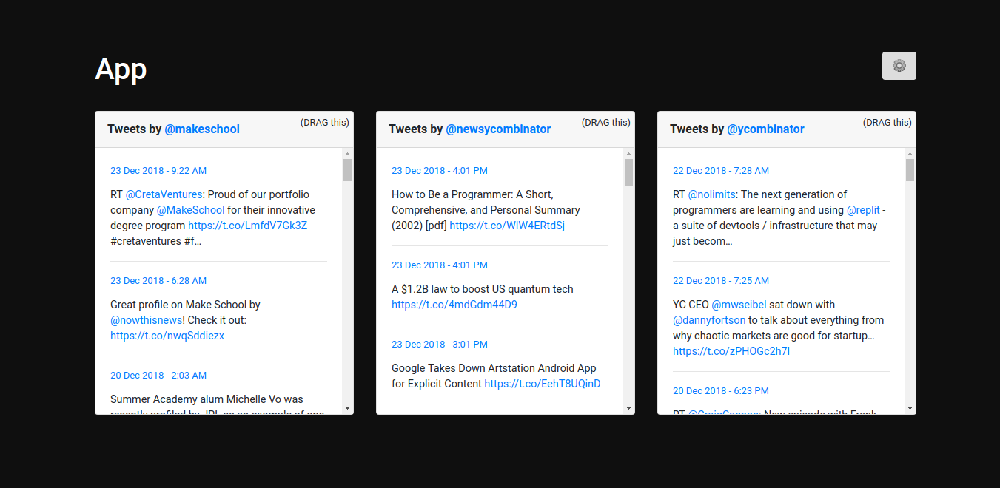

# How to run the app
1. Run `npm install`
2. Run `npm run start` to start the server
3. Run `npm run client-dev` to start the client dev mode
4. Open web browser http://localhost:3000

# Screenshot

# What
This repo is the solution from the following test:

## Frontend Coding Challenge
Introduction
We are interested in clean & concise JavaScript, HTML, and CSS. Your task is to deliver that by building a small web application built on Twitter’s REST API.
https://dev.twitter.com/rest/public

Please complete any number of the steps below within 3 days ideally and a maximum  of 7 days of us sending you this document. You may put in as many hours as you wish and use any libraries or frameworks you need to complete the task.

You may create an archive (.zip) and attach it to an email.

Your solution will be evaluated using the following criteria

- Following the requirements
- UI and user experience quality
- Code quality (organization, best practices, idiomatic code, design)

### Part I: Get the Starter Code
Pre-requisites: You must have Node.js and npm installed.

You can find a  zipped archive of the starter code on Dropbox here:
https://www.dropbox.com/s/l0uion6zev5q53a/ms-fe-code-challenge%202.zip?dl=0

If you have trouble running the starter code on Window, please go into server.js file, change this line: `var spawn = require(‘child_process’).spawn; to var spawn = require(‘child_process’).exec;`

You should make sure you update the files with your name, Twitter API key, and contact information.

### Part II: 

Use the Twitter API to display three columns containing the last 30 tweets from @MakeSchool, @newsycombinator and @ycombinator. Each tweet should include:

- The tweet content
- A well-formatted created_at date
- A link to the tweet
- For retweets and mentions, the username should be included.

### Part III: 

1. Make an ”edit layout” view that has a form to change the layout settings.
2. Use LocalStorage to persist and load the layout settings.
3. Configurable settings could include (you decide; you can pick your own):
  a. The order of the columns.
  b. The time range of the tweets shown.
  c. The number of tweets shown in each column.
  d. The overall palette/skin of the page.
4. The”edit layout” panel can appear either on the same page as the tweets page, on its own page, or embedded within the tweets layout - whichever you would like. There should be a straightforward way to toggle between edit and view modes, and it should be clear to the user which mode they are currently in.

### Part IV: Additional Challenges
If you feel inspired, here are more things you can do:

- Ensure a good responsive experience on mobile phones and tablets
- Use an interaction (like drag and drop) instead of a form field to order the columns
- Add another feature you feel is missing from our application
- Adding unit tests will be great